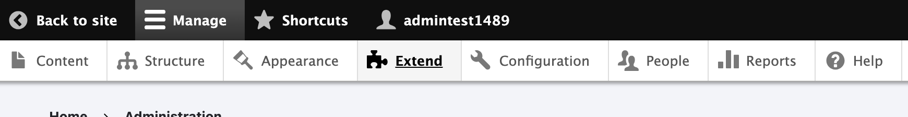
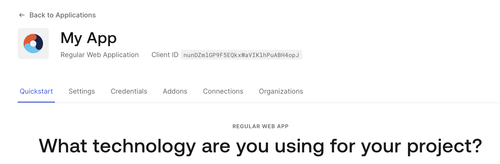

# Drupal OpenID Connect 

This guide walks through integrating Drupal with an authentication and 
authorization service via OpenID Connect. 

## Installing OpenID Connect (Alpha)

This configuration covers the alpha release of the 3.x branch. There is a 1.x 
stable branch not covered by this guide. 

Module URL: `https://www.drupal.org/project/openid_connect` 

    docker compose exec drupal composer require 'drupal/openid_connect:^3.0@alpha'

    kubectl exec drupal-... -- composer require 'drupal/openid_connect:^3.0@alpha'

Docker compose command output:

>  
> ./composer.json has been updated  
> Running composer update drupal/openid\_connect  
> Loading composer repositories with package information  
> Updating dependencies  
> Lock file operations: 2 installs, 0 updates, 0 removals  
>   - Locking drupal/externalauth (2.0.5)  
>   - Locking drupal/openid\_connect (3.0.0-alpha3)  
> Writing lock file  
> Installing dependencies from lock file (including require-dev)  
> Package operations: 2 installs, 0 updates, 0 removals  
>   - Downloading drupal/externalauth (2.0.5)  
>   - Downloading drupal/openid\_connect (3.0.0-alpha3)  
>   - Installing drupal/externalauth (2.0.5): Extracting archive  
>   - Installing drupal/openid\_connect (3.0.0-alpha3): Extracting archive  
> Generating autoload files  
> 42 packages you are using are looking for funding.  
> Use the `composer fund` command to find out more!  
> No security vulnerability advisories found.  
>

## 1) Configuring OpenID Connect 

1. Login to Drupal Dashboard  
2. Select Manage  
3. Select Extend
4. Scroll to User authentication  
5. Check External Authentication and OpenID Connect  
6. Click Install  
7. Status message; 2 modules have been enabled: ...  
8. Select Configuration  
9. Select OpenID Connect 
10. Select `+ Generic OAuth 2.0` 
11. Complete the form
  * Name: E.g. Sign in with Auth0
  * Client ID: \<pulled from Auth0 Application Settings\>
  * Client secret: \<pulled from Auth0 Application Settings\>
  * Allowed domains: \<pulled from Auth0 Application Settings\>
  * Select Auto discover endpoints
  * Issuer URL:  \<pulled from Auth0 Application Advance Settings\>
  * Scopes: profile openid email
12. Record the Redirect URL 
13. Select Create OpenID Connect client  

### 2) Update OpenID Connect Settings 

Change the OpenID Connect Settings to allow Auth0 user accounts to automatically 
be created. 

1. Select OpenID Connect Settings 
2. Select Settings 
3. Select Override registration settings 
4. __OpenID buttons display in user login form__ 
5. Select Above 
6. Update User claims mapping
   * Picture -> Picture
6. Select Save configuration

### 3) Update Drupal Account Settings

1. Select Manage -> Configuration -> People -> Account settings
2. Under Registration and cancellation 
3. Change __Who can register accounts?__ to __Visitors__
4. Unselect __Require email verification when a visitor creates an account__ 
5. Select Save configuration

## Authentication and Authorization Service (Auth0)

This guide takes advantage of the Auth0 free tier. Sign up can be completed on 
the Auth0 website: https://auth0.com. 

### 4) Create an Application

1. Login to the Auth0 Dashboard
2. Select Applications -> Applications 
3. Select `+ Create Application`
4. Enter a Name and select __Regular Web Applications__
5. Select Create
6. Select application technology __php__

#### 5) Application Settings

The settings for configuring the Drupal client are located in the `Settings` 
tab and under `Advance Settings`. 

1. Select __Settings__

Record the Domain, Client ID, Client Secret settings.

2. Scroll to and select __Advance Settings__
3. Select Endpoints 

Record the OpenID Configuration url

---

## OpenID Connect Configuration Screenshots

### 1 Drupal OpenID Configuration

1.2 From Drupal Dashboard > select Manage

1.3 Select Extend

1.5 Select User authentication

1.7 Enabled Status Message 

1.9 Select OpenID Connect

1.11 Configure Generic OAuth 2.0 Client

2.1 Configure OpenID Connect Settings

4.1 Auth0 Application 

