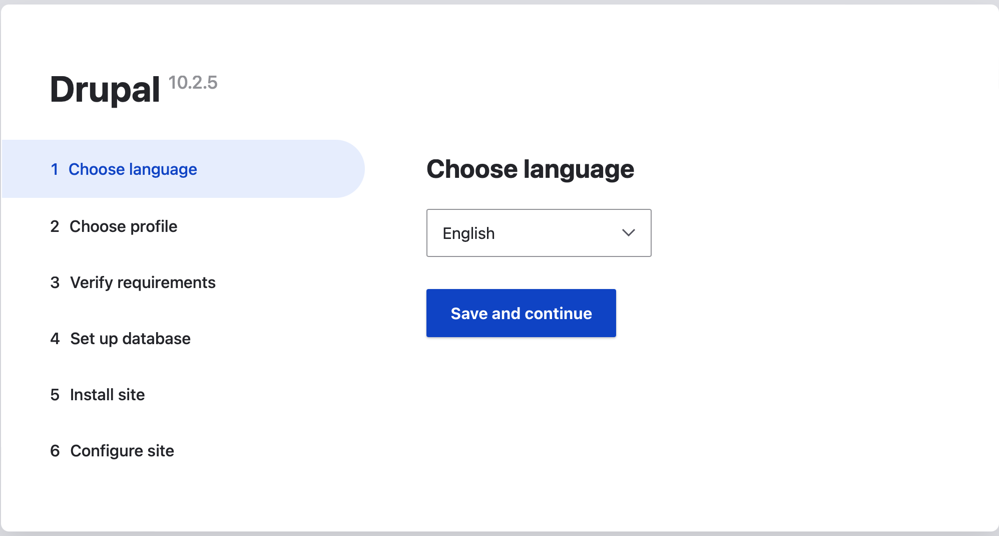
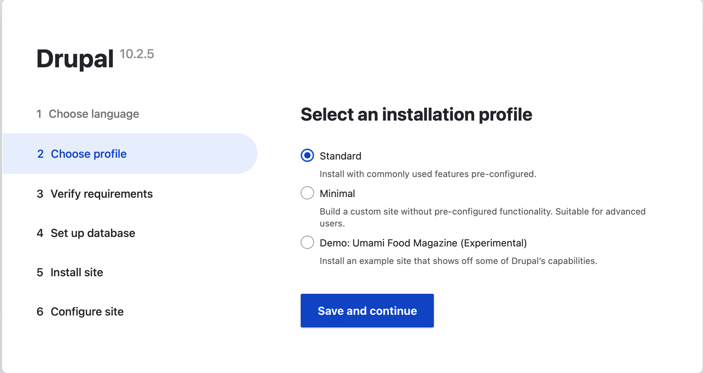
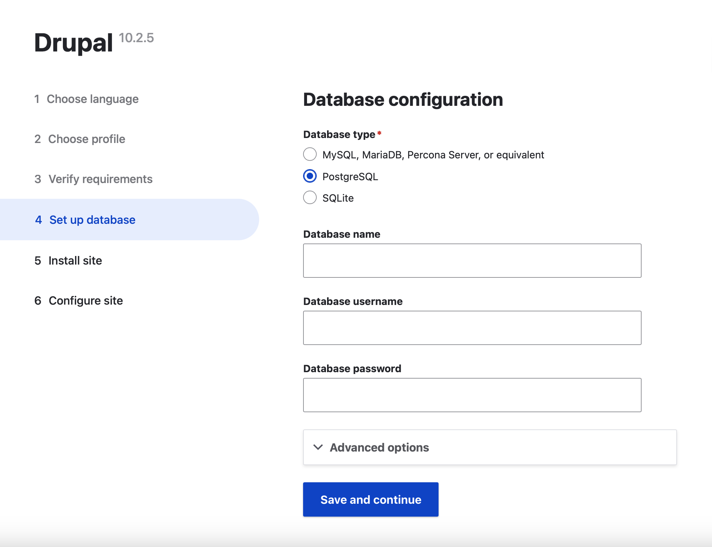
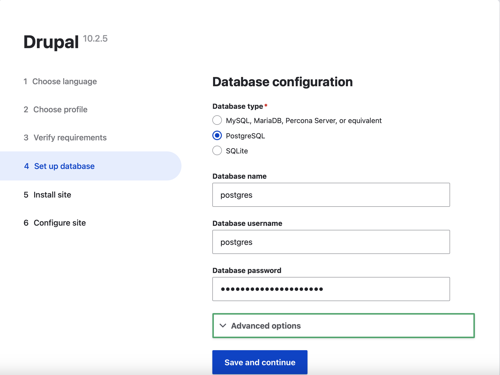
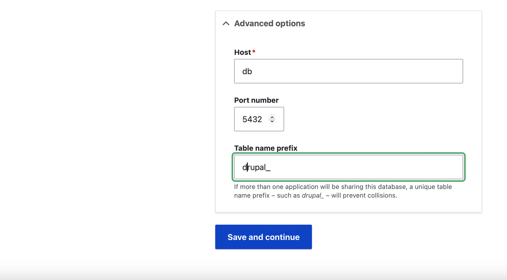
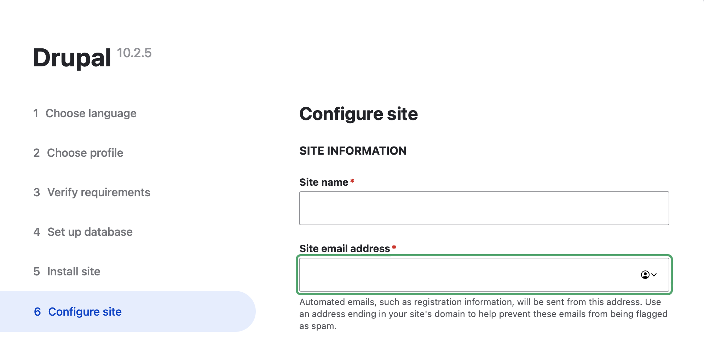
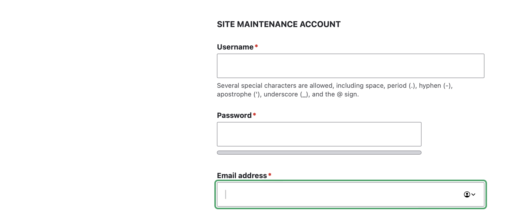
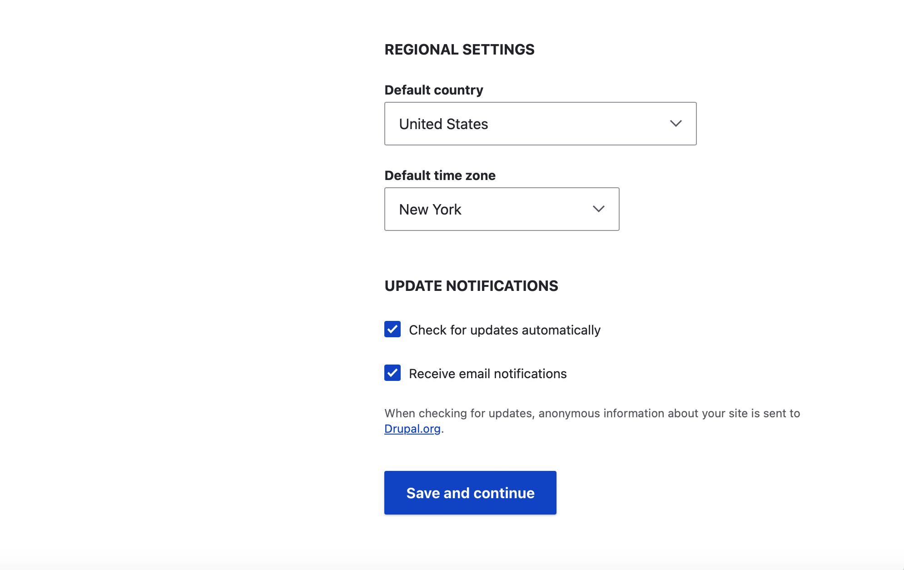

# Drupal Compose Runtime Configuration Guide

## Initial Configuration

The runtime environment includes traefik proxy services and how you access the 
post install configuration URL is dependent on whether you are running docker 
container services or kubernetes.

Docker services URL: http://drupal.docker.localhost

Kubernetes URL: http://drupal.k8s.localhost

### Configuring Drupal

1. Choose language  
   "Language of Choice"  
   Select Save and continue  
2. Choose profile  
   Standard  
   Install with commonly used features pre-configured  
   Select Save and continue  
3. Verify requirements  
   Automatically skipped  
4. Set up database  
   Select PostgreSQL  
   Database name: postgres  
   Database username: postgres  
   Database password: `copy from secret file`  
   Select Advanced options  
   Change Host: from `localhost` to `db`  
   Set table name prefix: drupal_  
   Select Save and continue  
5. Install site  
   Automatically completed  
6. Configure site  
   SITE INFORMATION  
     Site name: `<site_name>`  
     Site email address: `<email_address>`  
   SITE MAINTENANCE ACCOUNT  
     Username: `<enter_username>`  
     Password: `<password>`  
     Confirm password: `<password>`  
     Email address: `<email_address>`  
   REGIONAL SETTINGS  
     Default country: `<country>`  
     Default time zone: `<time zone>`  
   UPDATE NOTIFICATIONS  
     Check for updates automatically: uncheck  
     Receive email notifications: uncheck  
   Select Save and continue  

## OpenID Connect (Optional)

To install and configure the OpenID Connect module please see docs/openid\_connect.md.

## Installing Drush (Optional)

Drush is a command line shell and Unix scripting interface for Drupal.  

Module URL: https://www.drush.org

Install command: 

    docker compose exec drupal composer require 'drush/drush'

or 

    kubectl exec drupal-... -- composer require 'drush/drush'

Command output:

> ./composer.json has been updated  
> Running composer update drush/drush  
> Loading composer repositories with package information  
> Updating dependencies  
> Lock file operations: 22 installs, 0 updates, 0 removals  
> 
> - Locking chi-teck/drupal-code-generator (3.5.0)  
> - Locking consolidation/annotated-command (4.10.0)  
> - Locking consolidation/config (2.1.2)  
> - Locking consolidation/filter-via-dot-access-data (2.0.2)  
> - Locking consolidation/log (3.1.0)  
> - Locking consolidation/output-formatters (4.5.0)  
> - Locking consolidation/robo (4.0.6)  
> - Locking consolidation/self-update (2.2.0)  
> - Locking consolidation/site-alias (4.1.0)  
> - Locking consolidation/site-process (5.4.0)  
> - Locking dflydev/dot-access-data (v3.0.2)  
> - Locking drush/drush (12.5.2)  
> - Locking grasmash/expander (3.0.0)  
> - Locking grasmash/yaml-cli (3.2.1)  
> - Locking league/container (4.2.2)  
> - Locking nikic/php-parser (v5.0.2)  
> - Locking phootwork/collection (v3.2.2)  
> - Locking phootwork/lang (v3.2.2)  
> - Locking phpowermove/docblock (v4.0)  
> - Locking psy/psysh (v0.12.3)  
> - Locking symfony/polyfill-php81 (v1.29.0)  
> - Locking webflo/drupal-finder (1.2.2)  
>   Writing lock file  
>   Installing dependencies from lock file (including require-dev)  
>   Package operations: 22 installs, 0 updates, 0 removals  
> - Downloading consolidation/log (3.1.0)  
> - Downloading consolidation/self-update (2.2.0)  
> - Downloading webflo/drupal-finder (1.2.2)  
> - Downloading nikic/php-parser (v5.0.2)  
> - Downloading psy/psysh (v0.12.3)  
> - Downloading league/container (4.2.2)  
> - Downloading dflydev/dot-access-data (v3.0.2)  
> - Downloading grasmash/yaml-cli (3.2.1)  
> - Downloading grasmash/expander (3.0.0)  
> - Downloading consolidation/config (2.1.2)  
> - Downloading consolidation/site-alias (4.1.0)  
> - Downloading consolidation/site-process (5.4.0)  
> - Downloading symfony/polyfill-php81 (v1.29.0)  
> - Downloading phootwork/lang (v3.2.2)  
> - Downloading phootwork/collection (v3.2.2)  
> - Downloading phpowermove/docblock (v4.0)  
> - Downloading consolidation/output-formatters (4.5.0)  
> - Downloading consolidation/annotated-command (4.10.0)  
> - Downloading consolidation/robo (4.0.6)  
> - Downloading consolidation/filter-via-dot-access-data (2.0.2)  
> - Downloading chi-teck/drupal-code-generator (3.5.0)  
> - Downloading drush/drush (12.5.2)  
> - Installing consolidation/log (3.1.0): Extracting archive  
> - Installing consolidation/self-update (2.2.0): Extracting archive  
> - Installing webflo/drupal-finder (1.2.2): Extracting archive  
> - Installing nikic/php-parser (v5.0.2): Extracting archive  
> - Installing psy/psysh (v0.12.3): Extracting archive  
> - Installing league/container (4.2.2): Extracting archive  
> - Installing dflydev/dot-access-data (v3.0.2): Extracting archive  
> - Installing grasmash/yaml-cli (3.2.1): Extracting archive  
> - Installing grasmash/expander (3.0.0): Extracting archive  
> - Installing consolidation/config (2.1.2): Extracting archive  
> - Installing consolidation/site-alias (4.1.0): Extracting archive  
> - Installing consolidation/site-process (5.4.0): Extracting archive  
> - Installing symfony/polyfill-php81 (v1.29.0): Extracting archive   
> - Installing phootwork/lang (v3.2.2): Extracting archive  
> - Installing phootwork/collection (v3.2.2): Extracting archive  
> - Installing phpowermove/docblock (v4.0): Extracting archive  
> - Installing consolidation/output-formatters (4.5.0): Extracting archive  
> - Installing consolidation/annotated-command (4.10.0): Extracting archive  
> - Installing consolidation/robo (4.0.6): Extracting archive  
> - Installing consolidation/filter-via-dot-access-data (2.0.2): Extracting archive  
> - Installing chi-teck/drupal-code-generator (3.5.0): Extracting archive  
> - Installing drush/drush (12.5.2): Extracting archive  
>   5 package suggestions were added by new dependencies, use `composer suggest` to see details.  
>   Generating autoload files  
>   45 packages you are using are looking for funding.  
>   Use the `composer fund` command to find out more!  
>   No security vulnerability advisories found.  
>   Using version ^12.5 for drush/drush  

## Initial Configuration Screenshots

### 1 Choose language

### 2 Choose profile

### 4 Set up database

### 6 Configure site

