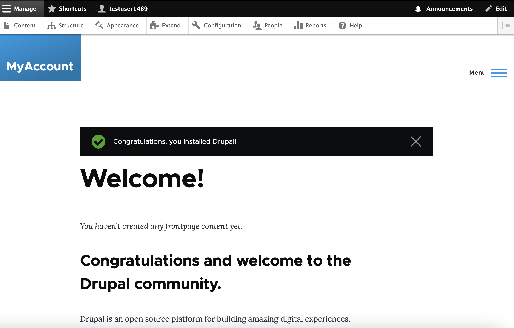

# Drupal Compose Runtime Configuration Guide

## Initial Configuration

After completing the post installation setup; access the Drupal 
configuration at http://localhost:8080.

1. Choose language  
   "Language of Choice"  
   Select Save and continue  
2. Choose profile  
   Standard  
   Install with commonly used features pre-configured  
   Select Save and continue  
3. Verify requirements  
   Automatically skipped  
4. Set up database  
   Select PostgreSQL  
   Database name: postgres  
   Database username: postgres  
   Database password: `copy from secret file`  
   Select Advanced options  
   Change Host: from `localhost` to `db`  
   Set table name prefix: drupal_  
   Select Save and continue  
5. Install site  
   Automatically completed  
6. Configure site  
   SITE INFORMATION  
     Site name: `<site_name>`  
     Site email address: `<email_address>`  
   SITE MAINTENANCE ACCOUNT  
     Username: `<enter_username>`  
     Password: `<password>`  
     Confirm password: `<password>`  
     Email address: `<email_address>`  
   REGIONAL SETTINGS  
     Default country: `<country>`  
     Default time zone: `<time zone>`  
  UPDATE NOTIFICATIONS  
     Check for updates automatically: uncheck  
     Receive email notifications: uncheck  
  Select Save and continue  

## Installing OpenID Connect (Alpha)

    $ cd <project_directory> 
    $ docker compose exec drupal composer require 'drupal/openid_connect:^3.0@alpha'

>  
> ./composer.json has been updated  
> Running composer update drupal/openid\_connect  
> Loading composer repositories with package information  
> Updating dependencies  
> Lock file operations: 2 installs, 0 updates, 0 removals  
>   - Locking drupal/externalauth (2.0.5)  
>   - Locking drupal/openid\_connect (3.0.0-alpha3)  
> Writing lock file  
> Installing dependencies from lock file (including require-dev)  
> Package operations: 2 installs, 0 updates, 0 removals  
>   - Downloading drupal/externalauth (2.0.5)  
>   - Downloading drupal/openid\_connect (3.0.0-alpha3)  
>   - Installing drupal/externalauth (2.0.5): Extracting archive  
>   - Installing drupal/openid\_connect (3.0.0-alpha3): Extracting archive  
> Generating autoload files  
> 42 packages you are using are looking for funding.  
> Use the `composer fund` command to find out more!  
> No security vulnerability advisories found.  
>  

## Screenshots

### 1 Choose language

### 2 Choose profile

### 4 Set up database

### 6 Configure site

### Drupal Landing Page

